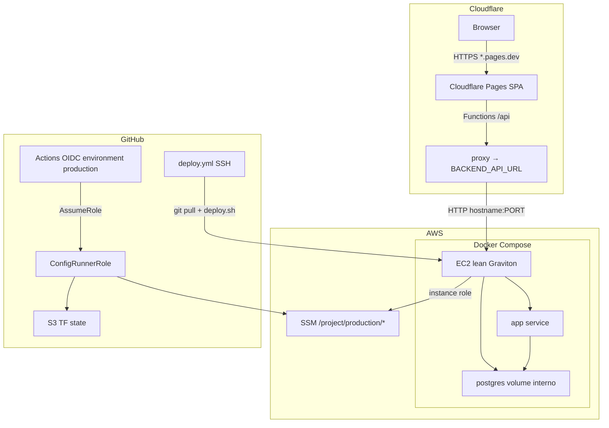

# Arquitetura Lean MVP

## Diagrama

## Dois Terraform / dois papéis

| Peça | Onde | Responsabilidade |
| --- | --- | --- |
| VM lean | `infra/terraform` (opcional) | Rede, SG, EC2, EIP |
| Config Arenex/SSM | CloudFormation bootstrap + `infra/production-config` | OIDC, state, SSM String/SecureString |
| Deploy app | `deploy.yml` + `deploy.sh` | Código e containers |

Fonte de verdade da config: **SSM**, não `.env.production` no disco da VM. O override Compose fica em `/opt/<project>-runtime/` (mode `0600`), fora do git.

## Por que force-recreate

Muitos Compose de MVP montam o código com bind-mount e sobem `node`/`pnpm start` **uma vez**. `git pull` atualiza o disco; `docker compose up -d` vê o container saudável e **não** reinicia o processo. Resultado: 404 em rota nova. O template de `deploy.sh` força recreate do serviço app.

## Frontend

Pages Functions fazem proxy same-origin para cookies funcionarem. Detalhes: [cloudflare-pages.md](cloudflare-pages.md).
